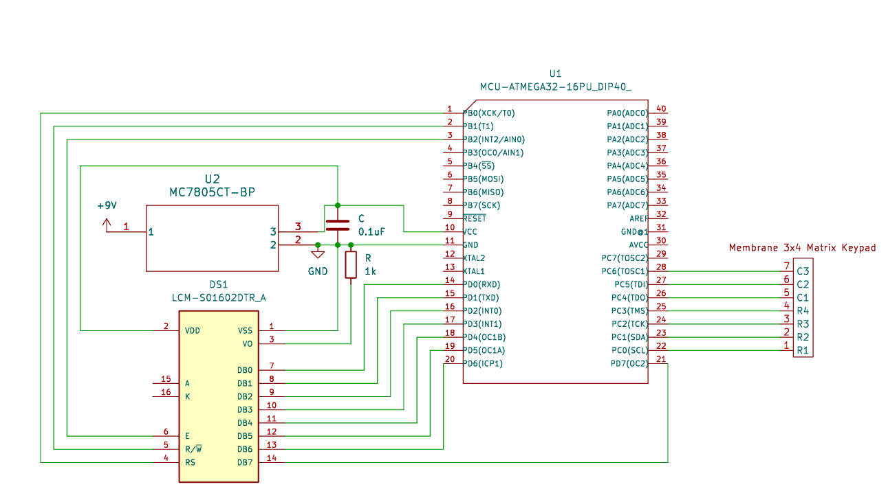

# LCDinoBytes 🦖

> A classic "endless runner" dinosaur game, built from scratch for an ATmega328P microcontroller and a 16x2 LCD screen.

---

## Gameplay Demo

---

## Features

-   **Endless Gameplay:** Run and dodge for as long as you can!
-   **Dynamic Obstacles:** Face a random sequence of high-flying birds and low-lying cacti.
-   **Player Actions:** Jump and Duck to avoid collisions.
-   **Animated Sprites:** Custom characters for running, jumping, and ducking animations.
-   **Increasing Difficulty:** The game speed gradually increases over time.
-   **High Score Tracking:** Your best score is saved until the device is reset.

---

## Hardware & Setup

### Required Components
*   ATmega328P Microcontroller
*   16x2 Character LCD (HD44780 compatible)
*   4x3 Matrix Keypad
*   Breadboard and Jumper Wires

### Wiring Schematic
Follow the schematic below to connect the components.

---

## How to Play

-   **Key `5`**: Jump
-   **Key `8`**: Duck (Hold)
-   **Key `1`**: Restart Game (from the "Game Over" screen)

The goal is simple: survive as long as possible to get the highest score!

---

## Technical Overview

### Player State Machine
The dinosaur's behavior is governed by a simple yet effective state machine. The program determines the dinosaur's current action—running, jumping, or ducking—by checking the status of boolean flags on every cycle. This constant evaluation of state and keypad input allows the dinosaur to seamlessly transition between actions, creating a responsive feel.

### Obstacle Generation
The game creates the illusion of an endless course by recycling a single obstacle. After spawning off-screen on a random row, the obstacle marches leftward. To ensure this is truly unpredictable, the game seeds its random number generator by reading the electrical noise from a floating Analog-to-Digital Converter pin. Once the obstacle clears the screen, its position is reset, and a new random type is assigned, ensuring a continuous challenge.

---
